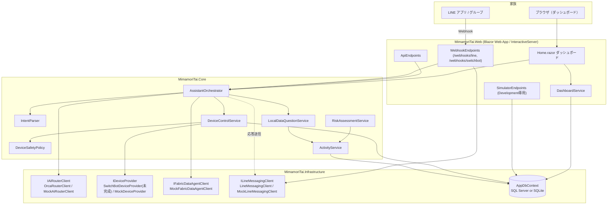

# CareRoute AI ／ 見守り隊

> 離れて暮らす家族のための、安全第一の高齢者見守りサービス
> *An elderly-watch ("見守り") assistant for families who live apart — hackathon project.*

## これは何か・解決したい課題

一人暮らしの高齢の家族を持つ人にとって、「今日は元気にしているだろうか」を毎日確認するのは負担です。一方で、カメラなどによる常時監視はプライバシーの観点で受け入れ難いことが多くあります。

**CareRoute AI / 見守り隊** は、家庭内のスマート家電（照明・扇風機など）の ON/OFF イベントから生活リズム（起床・就寝・深夜の活動など）を推定し、

- 家族が LINE や自然言語で「今日のお母さんどう？」と聞けば答え、
- 家電のリモート操作もチャットからできるが、
- **AIには絶対にすべてを任せない** — 安全な家電のみ、確信度が高い時だけ、しかも操作ログは成功・失敗・拒否のすべてを監査記録する

という設計を採っています。デバイス連携（SwitchBot）・AIルーティング（OrcaRouter）・データ分析（Microsoft Fabric Data Agent）・家族連絡（LINE）はすべて実連携とモックを切り替え可能で、**秘密情報が一切無くても `dotnet run` だけでフル機能のデモが動きます**。

## アーキテクチャ概要



## 主な機能

- **生活リズム推定**: `DeviceEvent`（家電ON/OFF）を集計し、起床・就寝・深夜活動回数などの `DailyActivity` を算出（`ActivityService`）。
- **見守りリスク判定**: 深夜活動・活動開始の遅れ・平均比の低下をルールベースでスコア化（`RiskAssessmentService`）。**AIには判定させない**設計。
- **自然言語アシスタント**: 「リビングのライトつけて」「今日のお母さんどう？」等をダッシュボードのチャット欄・LINEシミュレーター・実LINE Webhookから同じ `AssistantOrchestrator` で処理。
- **安全な家電操作ガードレール**: 後述の「安全設計」を参照。
- **家族共有フィード**: `FamilyMessage` としてLINE/Webでのやり取りを時系列表示。
- **AIルーティング可観測性**: OrcaRouterが解決したモデル名をレスポンスヘッダーから取得し `AiRequestLog` に記録、ダッシュボードに表示。
- **データQ&A**: Microsoft Fabric Data Agent が未設定の場合、`LocalDataQuestionService` がアプリDBから直接キーワードベースで回答。
- **ゼロシークレットのデモデータ**: `DemoDataSeeder` が14日分の決定論的な生活データ（起床遅延・深夜活動・低活動の3パターンを注入済み）を自動投入。

## 安全設計（このプロジェクトの差別化ポイント）

高齢者の家庭に置かれた家電を、AIの自然言語理解だけで自由に操作させることはできません。そこで `DeviceSafetyPolicy` が次のガードレールをすべて満たした場合のみ、ONへの操作を許可します。

1. **機器の安全分類**: `DeviceType` は `Safe`（Light, Fan, DemoDevice）とそれ以外すべての `Restricted`（Heater, Kettle, Microwave, CookingDevice, Plug, MotionSensor, ContactSensor, Unknown）に分類され、**AIからのON/Toggle操作は `Safe` のみ許可**。`Restricted` 機器でも `TurnOff`（消す操作）は安全側なので許可されます（非対称なガードレール）。
2. **遠隔操作許可フラグ**: `Device.RemoteControlAllowed == true` の機器のみ対象。
3. **確信度しきい値**: LLMが返す `confidence` が `IntentParser.MinimumConfidence`（**0.85**）以上でなければ操作を拒否。
4. **一意な機器解決**: エイリアス／名称から機器が一意に特定できない場合は操作しない（推測しない）。
5. **すべての試行を監査**: 成功・失敗・**拒否**を問わず、すべての操作要求は `DeviceCommand` として永続化される。

さらに、**LLMの出力は一切信用しません**。`IntentParser.TryParse` は不正なJSONに対して `null` を返し、`AssistantOrchestrator` は **1回だけ**修復を試みてそれでも失敗すれば、何も実行せずに諦めます。

## クイックスタート（秘密情報なしで動作）

```powershell
dotnet run --project src/MimamoriTai.Web
```

- 接続文字列 `ConnectionStrings:AppDb` が空の場合、自動的に SQLite ファイル `mimamoritai-demo.db`（アプリのベースディレクトリ配下）を使用し `EnsureCreatedAsync()` でスキーマを作成します。
- SwitchBot / OrcaRouter / Fabric / LINE のいずれも未設定なら、すべて Mock 実装（`MockDeviceProvider` / `MockAiRouterClient` / `MockFabricDataAgentClient` / `MockLineMessagingClient`）で動作します。
- 起動時に `DemoDataSeeder` が14日分のデモデータを自動投入するので、初回起動直後からダッシュボードが賑わいます。

起動後は `https://localhost:xxxx/` （`launchSettings.json` 参照）でダッシュボードを開いてください。

## 実サービスに接続する（User Secrets）

`src/MimamoriTai.Web` ディレクトリで、必要な項目だけ設定してください（**下記はすべてプレースホルダーです。実際の値は絶対にコミットしないこと**）。

```powershell
cd src/MimamoriTai.Web
dotnet user-secrets init

dotnet user-secrets set "ConnectionStrings:AppDb" "<your-sql-server-connection-string>"
dotnet user-secrets set "OrcaRouter:ApiKey" "<your-orcarouter-api-key>"
dotnet user-secrets set "Line:ChannelAccessToken" "<your-line-channel-access-token>"
dotnet user-secrets set "Line:ChannelSecret" "<your-line-channel-secret>"
dotnet user-secrets set "SwitchBot:Token" "<your-switchbot-token>"
dotnet user-secrets set "SwitchBot:Secret" "<your-switchbot-secret>"
dotnet user-secrets set "Fabric:WorkspaceId" "<your-fabric-workspace-id>"
dotnet user-secrets set "Fabric:DataAgentId" "<your-fabric-data-agent-id>"
dotnet user-secrets set "Fabric:McpUrl" "<your-fabric-data-agent-mcp-url>"
```

`SwitchBot:Enabled` と `Line:Enabled` は `appsettings.json` 側の `bool` フィールドですが、appsettings には含まれていないため、有効化する場合は `appsettings.Development.json` や環境変数（`SwitchBot__Enabled=true` など）で設定してください。それぞれの設定手順の詳細は `docs/SWITCHBOT_SETUP.md` / `docs/LINE_SETUP.md` / `docs/FABRIC_SETUP.md` を参照。

## プロジェクト構成

```
MimamoriTai.slnx
src/
  MimamoriTai.Core/            ドメインエンティティ・列挙型・抽象(Abstractions)・アプリケーションサービス
  MimamoriTai.Infrastructure/  EF Core (AppDbContext, DemoDataSeeder)、SwitchBot/OrcaRouter/Fabric/LINE の実装とモック
  MimamoriTai.Web/             Blazor ダッシュボード、API/Webhook/Simulator エンドポイント、Program.cs
tests/
  MimamoriTai.Tests/           xUnit テスト
docs/
  ARCHITECTURE.md              レイヤー構成・データモデル・処理フロー
  FABRIC_SETUP.md              Microsoft Fabric Data Agent のセットアップ手順
  LINE_SETUP.md                LINE Developers チャネルのセットアップ手順
  SWITCHBOT_SETUP.md           SwitchBot トークン取得と実装状況(TODO)
  SECURITY.md                  秘密情報の取り扱い・安全設計・監査ログ
  DEMO_SCENARIO.md              約5分のデモ台本
  REFERENCES.md                参考資料一覧
```

## API エンドポイント一覧

| メソッド | パス | 説明 |
|---|---|---|
| GET | `/health` | ヘルスチェック |
| GET | `/api/devices` | 登録済み機器一覧 |
| GET | `/api/devices/{id}` | 機器詳細＋最終イベント |
| POST | `/api/assistant/message` | 自然言語メッセージをアシスタントに送信（Web/LINE/Systemいずれの入力経路にも使用） |
| GET | `/api/activity/today` | 本日の生活アクティビティ集計 |
| GET | `/api/activity/recent` | 直近N日（既定14日）のアクティビティ集計 |
| POST | `/webhooks/line` | LINE Messaging API のWebhook受信（署名検証あり） |
| POST | `/webhooks/switchbot` | SwitchBot Webhook受信用プレースホルダー（ペイロード未実装） |
| POST | `/api/simulator/events` | デモ用イベント注入（`Development`環境限定） |

## テストの実行

```powershell
dotnet test
```

（`tests/MimamoriTai.Tests` は xUnit。現状の内容は最小限のため、安全設計まわり（`DeviceSafetyPolicy`, `IntentParser`）に対するテスト追加を推奨します。）

## 現在Mockの部分（実連携が未完成な箇所）

| 統合 | 状態 | 詳細 |
|---|---|---|
| SwitchBot | ⚠️ 未完成 | `SwitchBotClient` は認証・HTTP送受信まで実装済みだが、`SwitchBotDeviceProvider` のレスポンスDTOマッピングは**実機で仕様確認するまで未実装**（`NotImplementedReason` を返す）。詳細は `docs/SWITCHBOT_SETUP.md`。 |
| OrcaRouter | ✅ 設定すれば実接続 | `OrcaRouter:ApiKey` が空の間は `MockAiRouterClient` が固定応答を返す。 |
| Microsoft Fabric Data Agent | 🟡 モック稼働 | `MockFabricDataAgentClient` は常に `IsConfigured = false` を返し、代わりに `LocalDataQuestionService` がDBから直接回答。実際のMCP接続クライアントは未実装（`docs/FABRIC_SETUP.md` 参照）。 |
| LINE | ✅ 設定すれば実接続 | `Line:ChannelAccessToken`/`ChannelSecret` が空の間は `MockLineMessagingClient` がダッシュボードのLINEシミュレーターとして動作。署名検証ロジックはモックでも有効。 |
| データベース | ✅ 両対応 | 接続文字列があれば SQL Server + マイグレーション、無ければ SQLite ファイルへ自動フォールバック。 |
