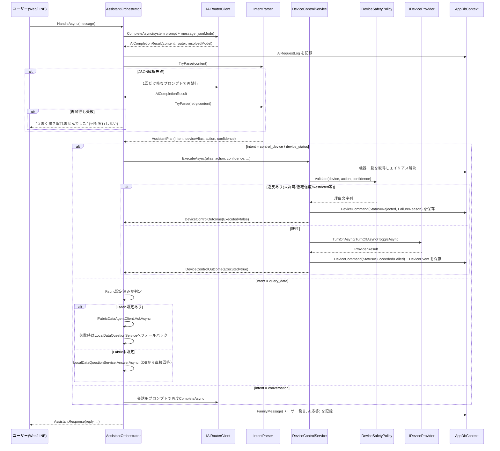
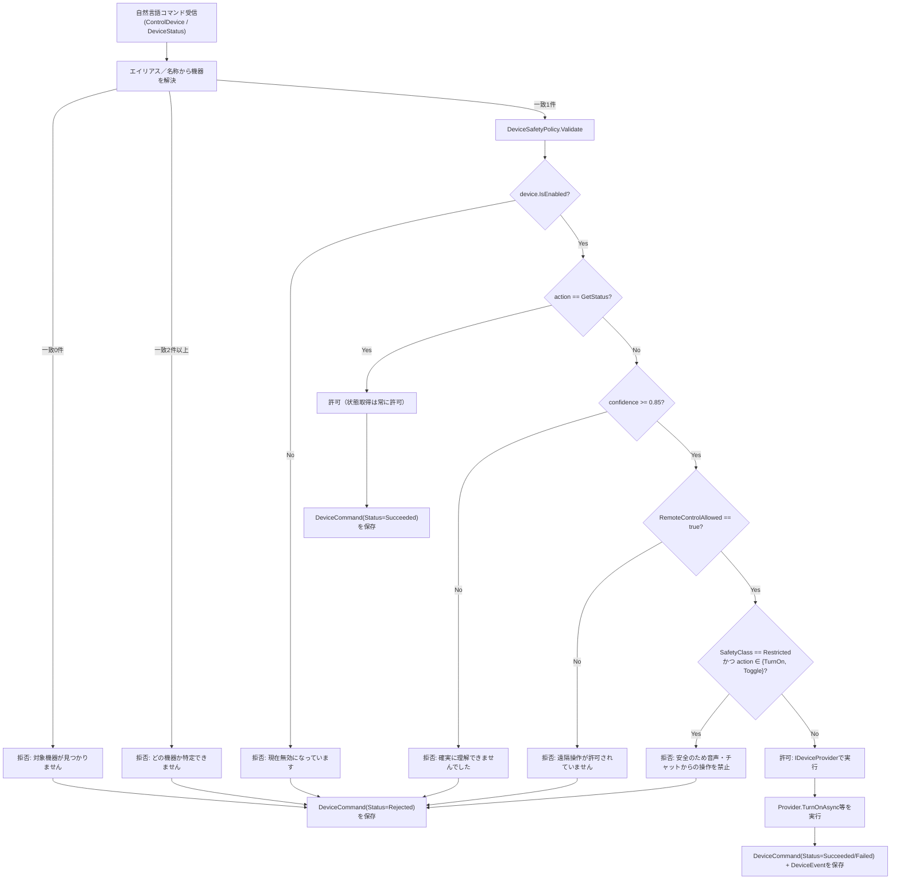

# アーキテクチャ

## レイヤーと依存方向

```
MimamoriTai.Web  ──depends on──>  MimamoriTai.Infrastructure  ──depends on──>  MimamoriTai.Core
```

- **MimamoriTai.Core**（ドメイン層／アプリケーション層）
  - `Domain/Entities.cs`, `Domain/Enums.cs`: エンティティと列挙型。EF Coreに依存しない素のPOCO。
  - `Abstractions/*.cs`: `IAiRouterClient`, `IDeviceProvider`, `IFabricDataAgentClient`, `ILineMessagingClient`, `ISwitchBotClient`, `IAppDbContext` などのインターフェース。**Core はどの外部サービスにも直接依存しない**。
  - `Application/*.cs`: `AssistantOrchestrator`, `DeviceControlService`, `DeviceSafetyPolicy`, `IntentParser`, `RiskAssessmentService`, `ActivityService`, `HouseholdTime`, `LocalDataQuestionService`, `WatchAlertService`（LINE見守りアラート、詳細は `docs/LINE_SETUP.md`）などのユースケース実装。I/Oは `Abstractions` 経由でのみ行う。
  - 依存先: `Microsoft.EntityFrameworkCore`（`DbSet<T>` の型としてのみ）。外部サービスSDKには依存しない。

- **MimamoriTai.Infrastructure**（実装層）
  - `Data/`: `AppDbContext`（`IAppDbContext` 実装）、`AppDbContextFactory`（デザインタイム用）、`DemoDataSeeder`。
  - `Devices/`: `ISwitchBotClient` の実装 `SwitchBotClient`、`IDeviceProvider` の実装 `SwitchBotDeviceProvider` と `MockDeviceProvider`。
  - `Ai/`: `IAiRouterClient` の実装 `OrcaRouterClient` と `MockAiRouterClient`。
  - `Fabric/`: `IFabricDataAgentClient` の実装 `MockFabricDataAgentClient`（実MCPクライアントは未実装）。
  - `Line/`: `ILineMessagingClient` の実装 `LineMessagingClient` と `MockLineMessagingClient`、および共有の `LineSignature`（HMAC検証）。
  - `ServiceCollectionExtensions.cs`: **すべての実装／モックの選択ロジックがここに集約されている**唯一の場所。

- **MimamoriTai.Web**（プレゼンテーション層）
  - `Components/Pages/Home.razor`: ダッシュボードUI（Blazor Server, `@rendermode InteractiveServer`）。データがデモかSwitchBot実機かを示すチップと、「実機を同期」ボタン（`DeviceSyncService`呼び出し）を表示する。
  - `Services/DashboardService.cs`: 画面表示用の読み取りモデル (`DashboardModel`) を組み立てる。
  - `Endpoints/ApiEndpoints.cs`, `WebhookEndpoints.cs`, `SimulatorEndpoints.cs`, `AlertEndpoints.cs`, `DeviceSyncEndpoints.cs`: Minimal API。
  - `Services/WatchAlertBackgroundService.cs`: `IHostedService`。既定世帯の見守りアラートを定期的に評価する。
  - `Services/SwitchBotPollingBackgroundService.cs`: `IHostedService`。SwitchBotが設定されている場合のみ、実機のステータスを定期ポーリングしON/OFF・人感・開閉の状態変化を `DeviceEvent`（`Source=SwitchBotPoll`）として記録する。SwitchBot未設定時は即座に何もせず終了するため、デモ経路・既存テストへの影響はない。
  - `Program.cs`: DI登録、DB初期化（マイグレーション or `EnsureCreatedAsync` + デモシード）。

## 抽象化とモック戦略

`MimamoriTai.Infrastructure/ServiceCollectionExtensions.cs` の `AddMimamoriTaiInfrastructure` が、設定値の有無に応じて実装とモックを切り替える唯一の分岐点です。

| インターフェース | 設定が無い場合 | 設定がある場合 |
|---|---|---|
| `IDeviceProvider` | `MockDeviceProvider`（`SwitchBotOptions.IsConfigured` が false の時に登録） | `SwitchBotDeviceProvider`（`SwitchBotOptions.IsConfigured` が true の時のみ登録） |
| `IAiRouterClient` | `MockAiRouterClient` | `OrcaRouterClient`（`OrcaRouterOptions.IsConfigured` が true の時のみ登録） |
| `IFabricDataAgentClient` | `MockFabricDataAgentClient`（常に登録。実MCPクライアントは未実装） | — |
| `ILineMessagingClient` | `MockLineMessagingClient` | `LineMessagingClient`（`LineOptions.IsConfigured` が true の時のみ登録） |
| `IAppDbContext` (`AppDbContext`) | SQLite ファイル (`mimamoritai-demo.db`) | 接続文字列があれば SQL Server |

**実機（SwitchBot）への切り替え**: `SwitchBotDeviceProvider` はSwitchBot OpenAPI v1.1のレスポンス（`GET /v1.1/devices` の `deviceList`/`infraredRemoteList`、`GET /v1.1/devices/{id}/status` の機種別フィールド）を実装済みで、`statusCode` が100以外の場合や不正なJSONは例外を投げず失敗として扱う（詳細は `docs/SWITCHBOT_SETUP.md`）。`SwitchBot:Enabled=true`＋Token/Secretで有効化した後、`DeviceSyncService`（ダッシュボードの「実機を同期」ボタン、または `POST /api/devices/sync`）を実行して実機の機器一覧をDevicesテーブルへ反映する。反映済みの機器は `SwitchBotPollingBackgroundService` が定期的（既定5分、`SwitchBot:PollIntervalMinutes`）にステータスをポーリングし、ON/OFF・人感・開閉の変化を `DeviceEvent`（`Source=SwitchBotPoll`）として記録するため、リスク判定・アラートも実データに基づいて動作する。

各モックは「設定が無ければ安全に倒れる」ことを目的としており、`IsConfigured` プロパティを通じて呼び出し側（`AssistantOrchestrator` や `DashboardService`）が実接続かどうかを判定できます。

## データモデル

| エンティティ | 目的 | 主なフィールド |
|---|---|---|
| `Household` | 見守り対象の世帯 | `Name`, `People`, `Devices` |
| `Person` | 世帯の構成員（本人／家族／管理者） | `DisplayName`, `Role`（`PersonRole`） |
| `Device` | 家電機器 | `ExternalDeviceId`, `Alias`, `DeviceType`, `Provider`, `RemoteControlAllowed`, `SafetyClass`, `IsActive`（プロバイダから消えた機器を削除せず無効化するためのフラグ） |
| `DeviceEvent` | 家電の状態変化イベント（ON/OFF等） | `State`, `PowerWatts`, `Source`（`EventSource`: `Seed`/`Mock`/`Simulator`/`AppCommand`/`SwitchBotWebhook`/`SwitchBotPoll`）, `OccurredAtUtc` |
| `DeviceCommand` | 自然言語／API経由の操作要求（**成功・失敗・拒否すべて記録**） | `Action`, `Status`（`CommandStatus`）, `FailureReason`, `AiResolvedModel` |
| `FamilyMessage` | 家族間・AIとのメッセージ（チャット/LINE） | `Content`, `MessageType`, `Source` |
| `RiskAssessment` | 見守りリスク判定の履歴 | `RiskLevel`, `Score`, `Reason` |
| `WatchAlert` | LINE見守りアラートの送信履歴（重複防止のクールダウン判定にも使用） | `PersonId`, `RiskLevel`, `Score`, `Reason`, `Message`, `SentAtUtc`, `Success`, `Error` |
| `DailyActivitySummary` | 日次の活動サマリー（現状は`ActivityService`が都度計算し、このテーブルへの永続化は未実装） | `FirstActivityTime`, `DeviceUsageCount`, `NightActivityCount` |
| `AiRequestLog` | AIルーター呼び出しの監査ログ | `Purpose`, `Router`, `ResolvedModel`, `DurationMs`, `Success` |

## アシスタント処理フロー（シーケンス図）

`AssistantOrchestrator.HandleAsync` は、Webのチャット・LINEシミュレーター・実LINE Webhookのいずれからも同じ入口として呼ばれます。



## 安全ガードレールのフロー



重要な設計判断:
- 判定ロジックは `DeviceSafetyPolicy` に集約され、I/Oを持たないため単体テストが容易。
- **拒否も含めすべての試行が `DeviceCommand` として監査可能**（`DeviceControlService.RejectAsync`）。
- LLMの出力（`confidence`, `deviceAlias`）は信用されず、必ずルールベースの `Validate` を通過する。
