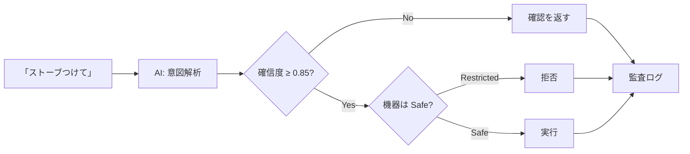
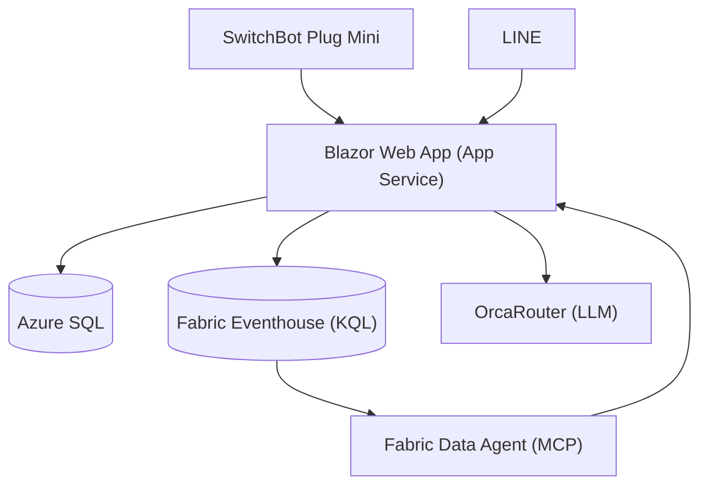
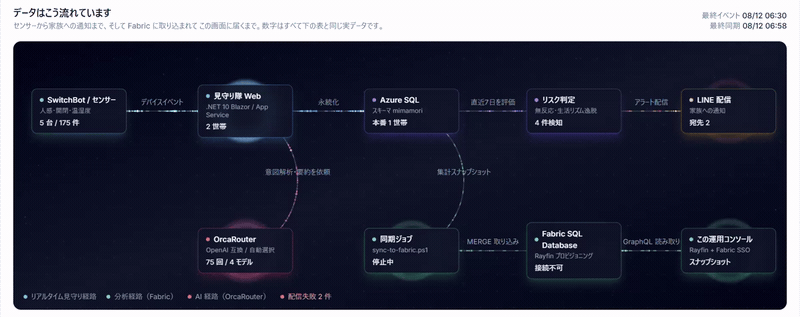

# 離れて暮らす高齢の家族を見守るサービスを作った ― 本人は「エアコンつけて」、家族は LINE で様子がわかる（Azure + Microsoft Fabric）

> ハッカソン提出作品「**CareRoute AI / 見守り隊**」の開発記録です。
> 足腰が弱ってくると、リモコンを取りに行くこと自体が一仕事になります。本人は**移動せずに話しかけるだけ**で家電を操作でき、離れて暮らす家族はその様子から**カメラなしで**生活リズムを把握できる、というサービスを作りました。
>
> Qiita 公開版: https://qiita.com/monoqlo78/items/27ea5bfa760bd8e3c3b7

この記事は「作ったもの紹介」半分、「壊れ方の記録」半分です。とくに後半の**沈黙して壊れた3つの障害**は、同じ構成を組む人には役に立つと思います。


---

## 1. 作ったもの

作りたかったのは、**見守られる側と見守る側の両方が楽になる**サービスです。

### 本人側：移動しないで家電を操作できる

足腰が弱ってくると、「エアコンのリモコンを取りに行く」「照明のスイッチまで歩く」が、それだけで一仕事になります。夜中に寒くて起きたときに、暗い部屋を歩いてスイッチまで行くのは転倒のリスクそのものです。

なので本人は、**移動せずに「エアコンつけて」と言うだけ**で操作できるようにしました。手順や機器名を覚える必要はなく、普通の言葉で通ります。

文字とボタンを大きくした専用画面（`/one-touch`）も用意しました。見守る側と見守られる側では、必要な情報も操作量もまったく違うためです。


### 家族側：カメラを付けずに様子がわかる

一方で、離れて暮らす家族にとっては「今日は元気にしているだろうか」を毎日確認するのが地味に負担になります。かといってカメラを付けるのは、見られる側にとって受け入れ難い。

そこで **家電の ON/OFF と消費電力だけ**を見ることにしました。

- 朝、照明が点けば「起きた」
- 夜中に何度も点けば「眠れていないかもしれない」
- 昼過ぎまで何も動かなければ「いつもと違う」

映像も音声も取らないので、見られる側の心理的な負担がほぼありません。取れる情報は少ないですが、「生活リズムの変化」を見るには十分でした。

うまくいったと思っているのは、**本人が楽をするための操作が、そのまま家族の安心材料になる**ことです。本人が「暑いからエアコンつけて」と言えば、家族側には「今日は昼にエアコンを入れている＝普段どおり動けている」として届きます。見守るための余計な操作を、本人に一切お願いしていません。

家族側は LINE で聞くだけです。

```
娘：今日のお母さんどう？
Bot：今朝6時40分に寝室の照明が点いています。
　　 いつもより30分早い起床です。日中の活動も普段どおりです。
```

家電の操作もチャットからできます。ただし **ここが本題**で、AI に操作を任せていません。

実際の LINE 画面がこれです。


「今日の様子」を押すと、その日の家電の使われ方をまとめて返します。
このスクリーンショットでは、まだその日の記録がないので
**「記録されていません」と正直に返しています**。ここが後述の本題です。

ボタンを押すだけでも使えるようにしてあります。


「助けて」には必ず **119番の案内**が付きます。
このサービスは緊急通報の代わりにはならない、という立場を最初に示しています。

---

## 2. いちばん時間をかけたところ：AIを信用しない

「話しかけるだけで家電が動く」を本気でやるなら、**間違えたときの代償**から設計する必要があります。使う人は自分で機器のところまで行って戻せない、というのが前提だからです。

LLM に「意図を解析して家電を操作する」をやらせると、デモは一発で動きます。問題は、**間違えたときに何が起きるか**です。

「ストーブつけて」を誤解して真夏に暖房を入れる。深夜に照明を全部点ける。高齢者の家でそれをやると、便利どころか事故です。

なので、AI の出力を**そのまま実行しない**構造にしました。



設計の要点は3つです。

**(1) 機器を安全クラスで分ける。**
照明・扇風機は `Safe`、ヒーター類は `Restricted`。AI がどれだけ自信満々に「ONにしろ」と言っても、ルールベースの最終段（`DeviceSafetyPolicy`）がブロックします。

実際に本番環境で「ストーブつけて」と入力した結果がこれです。拒否メッセージが返り、右下の電気ストーブは**停止中のまま**です。


**(2) ON と OFF を非対称にする。**
危険機器の ON は拒否しますが、**OFF は通します**。「消す」は安全性を高める方向の操作だからです。ここを対称にすると「危ないから何も操作できない」になって使い物になりません。

同じストーブに「消して」と言うと、今度は受理されます（実行前に確認を挟みます）。


機器カードにも「安全のため、遠隔では消す操作だけできます」と出しています。**拒否の理由が使う人に見えないと、ただの故障に見える**ためです。

**(3) 拒否も含めて全部記録する。**
成功・失敗・拒否のすべてを `DeviceCommand` に残します。「AIが何をしようとしたか」が後から追えないと、そもそも安全性を主張できません。

この「AIは会話には使うが、危険判断には使わない」という線引きが、このプロジェクトで一番考えたところです。

LINE 上でも同じです。自由文の「リビングの電気を付けれる？」に対して、
**必ず「よろしいですか？」を1回挟みます**。


「はい」を受け取ってはじめて実行し、実行後に結果を返します。
この確認は AI の確信度が高くても省略されません。
**AI が担うのは「どの家電をどうしたいか」の解釈までで、実行してよいかを決めるのは人が押した「はい」だけ**です。

**(4) 権限がないときは、枠ごと出さない。**
同じ考え方を管理画面にも通しました。全世帯の状況を見る `/admin` は、サインインが構成されている環境では、許可リストに識別子が載っている利用者だけが中身を見られます。リストが空なら誰も一致しません。未許可のときは、画面の枠だけ出してデータを空にするのではなく、**そもそも読み込み処理を走らせずに `null` を返して拒否**します。同じ画面を出すAPIも、存在自体を答えないよう 404 を返します。


---

## 3. 構成



| 用途 | 使ったもの |
|---|---|
| アプリ | .NET 10 / Blazor Web App（InteractiveServer） |
| 業務データ | Azure SQL Database |
| 時系列分析 | Microsoft Fabric Eventhouse（KQL） |
| 自然言語分析 | Fabric Data Agent（MCP 経由） |
| LLM | OrcaRouter |
| デバイス | SwitchBot Plug Mini (JP) |
| 家族接点 | LINE Messaging API / LINE Login / LIFF |

図にするとこうですが、この流れは運用コンソールの中でそのまま動いています。数字はダミーではなく、その時点の実データです。



ちなみにこのキャプチャ、下段に「同期ジョブ 停止中」「Fabric SQL Database 接続不可」がそのまま映っています。演出ではなく本当に止まっている状態です。**止まっていることが一目で見える**という点だけは、今回いちばん役に立った画面かもしれません（なぜ止まるのかは4章で書きます）。

**外部連携はすべてモックに差し替え可能**にしてあります。`dotnet run` だけで、APIキーゼロでフル機能のデモが動きます。ハッカソンで「当日 API が落ちて何も見せられない」を避けたかったのと、テストが書きやすくなるためです。結果的に後者の恩恵のほうが大きく、**テストは681件**まで増えました。

データの流れは2系統に分けています。

- `DeviceEvents` … ON/OFF などの**状態変化**イベント
- `SwitchBotPlugReadings` … ポーリング周期ごとの**電力テレメトリ**（変化がなくても毎回）

意図的にコードを共有していません。片方の設定ミスや障害が、もう片方を巻き込まないようにするためです。**これは後で本当に効きました**（後述）。

蓄積したデータは「いつもと比べてどうか」に変換して見せています。絶対値ではなく**平常時との差**にしたのは、そもそも「普通」が人によって違うからです。


### 3-1. OrcaRouter ― 自動ルーティングと「締め切り」をどう両立させたか

LLM の呼び出しは **OrcaRouter** に寄せました。OpenAI 互換なので、`BaseUrl` を差し替えて `Bearer` を付けるだけで済みます。既定は名前付きルーターの `orcarouter/auto` です。

面白かったのは、**素直に `auto` に全部任せると壊れる箇所が2つあった**ことです。どちらも「モデルを選ぶ」ではなく「**どこでモデルを固定するか**」の話でした。

**(1) JSON を要求する呼び出しだけは固定する。**

意図解析は `response_format: json_object` を使っています。ところが Anthropic 系はこのパラメータに対応していません（OrcaRouter のドキュメントに明記があります）。`auto` は全モデルが候補なので、**たまたま Anthropic に解決された回だけ意図解析が壊れる**という、いちばん嫌な壊れ方をします。

なので JSON モードのときだけモデルをピン留めしました。

```csharp
// JSON モードは何よりも優先。意図解析は毎回同じ挙動でないと困る。
if (jsonMode && !string.IsNullOrWhiteSpace(JsonModel)) return JsonModel;

// 締切のある呼び出し（purpose が "-fast" で終わる）だけ速いモデルに寄せる。
if (purpose?.EndsWith("-fast") == true && !string.IsNullOrWhiteSpace(FastModel)) return FastModel;

// それ以外は auto のまま。ルーティングされること自体に価値があるので。
return Model;
```

**(2) LINE の8秒制限に、推論モデルの分散が入らない。**

LINE の webhook は1イベント **8秒**で打ち切ります。超えると、内部で正しい要約ができていても家族には定型のタイムアウト文しか届きません。つまり応答速度が**機能の成否そのもの**でした。

実測がこれです。

| 用途 | モデル | 実測 |
|---|---|---|
| 意図分類（JSON） | `openai/gpt-4.1-mini`（固定） | 約2秒 |
| 状況要約 | `orcarouter/auto` → `qwen3.7-plus` / `deepseek-v4-pro` / `glm-5.2` | **5.6〜51秒** |
| 状況要約 | `openai/gpt-4.1-mini`（固定） | **3〜5秒** |

`auto` は推論系モデルに解決されることがあり、そのとき要約に20〜50秒かかります。速いときは5.6秒で返るので、**平均ではなく分散が問題**でした。この状態を LINE に載せると、いずれ必ずタイムアウトします。

かといって全部固定にすると、OrcaRouter を使っている意味が薄れます。毎回違うモデルに解決される様子は、ホーム画面に「AIモデル」として出していて、**それ自体がこのサービスの見せ場**でもありました。

そこで**経路ごとに決める**ことにしました。

| 経路 | `purpose` | モデル | 理由 |
|---|---|---|---|
| LINE webhook | `summary-fast` | 固定の速いモデル | 8秒の締切がある |
| Web UI / API | `summary` | `orcarouter/auto` | 締切が無いので自動ルーティングを活かす |

`-fast` は**チャネル名ではなく「締切がある呼び出し」を表す接尾辞**にしてあります。呼ぶ側が「自分は待てない」と宣言する形なので、他の用途にもそのまま広げられます（`intent-fast` など）。

**(3) 落ちたときの代替を宣言しておく。**

`extra_body.models` にフォールバックチェーン（最大5件）を渡しています。主モデルが 5xx / 429 で落ちたら次に回ります。実装側でも 429 と 5xx だけを再試行対象にし、`Retry-After` を尊重しつつ上限で頭打ちにしました。**4xx は再試行しません**。こちらの投げ方が悪いものを投げ直しても同じだからです。

```csharp
// 429（絞られた）と 5xx（上流の不調）だけがもう一度試す価値がある。4xx は無い。
private static bool IsRetryable(int status) => status == 429 || status >= 500;
```

**(4) 結果として何が良かったか。**

応答ヘッダの `X-Orca-Router` / `X-Orca-Resolved-Model` を拾って、**実際にどのモデルが応答したか**を画面と監査ログに残しています。「AI が答えました」ではなく「この呼び出しは `qwen3.7-plus` が 11.6秒で答えました」まで見えるので、遅さの原因を推測しないで済みました。上の表の数字も、この記録から出しています。

ちなみに `auto` の分散に気づけたのは、この表示を作っていたからです。**ルーティングを任せるなら、任せた結果が見えている必要がある**、というのが今回の実感でした。

### 3-2. 秘密をどこに「置かなかった」か

扱っているのが家庭の中なので、ここは最後まで削りませんでした。方針は3つだけです。**持たない・渡さない・見せない**。

#### 持たない ― Key Vault とマネージドID

本番の App Service には、アプリ設定にシークレットを**1件も置いていません**。起動時に Key Vault から読みます。

```csharp
// Program.cs の冒頭。KeyVault:Uri があるときだけ構成プロバイダーを足す
builder.AddMimamoriTaiKeyVault();
```

認証は `DefaultAzureCredential`、App Service のシステム割り当てマネージドIDに `Key Vault Secrets User` を付けるだけです。ここが気持ちのいいところで、**Key Vault に繋ぐための資格情報そのものが存在しません**。漏れるものが無い。

ハマったのは名前の書き方でした。Key Vault のシークレット名に `:` は使えないので、階層は `--` で表します。App Service のアプリ設定は `__` です。**同じ設定キーなのに、置き場所によって記法が3通りある**。

| 置き場所 | 書き方 |
| --- | --- |
| `appsettings.json` | `OrcaRouter:ApiKey` |
| App Service のアプリ設定 | `OrcaRouter__ApiKey` |
| Key Vault | `OrcaRouter--ApiKey` |

これを間違えると、例外は出ずに**キーが空のまま起動して、呼び出したときだけ静かに失敗します**。4章と同じ壊れ方です。

なお `KeyVault:Uri` が空のときはプロバイダーごと追加しません。`git clone` して `dotnet run` すればモックで全機能が動く、というゼロコンフィグをここでも壊さないためです。

#### 渡さない ― 署名検証と、推測しない紐付け

そもそも**パスワードを預かっていません**。ログインは OpenID Connect（Entra External ID / LINE Login）に委譲していて、こちらが保存するのは「どの発行元の、どのサブジェクトか」だけです。持っていないものは漏れません。

LINE の Webhook は署名（HMAC-SHA256）を検証してから中身を見ます。比較は定数時間で行います。

```csharp
// 途中で return すると「どこまで一致したか」が漏れる。だから最後まで比較する。
return CryptographicOperations.FixedTimeEquals(expected, actual);
```

そのうえで、**送信元と世帯の紐付けを推測しません**。6桁の連携コードを一度だけ使って結びつけます。コードはハッシュで保存し、有効期限10分・使い捨て・試行5回まで。既定では「未リンクの送信元をとりあえず既定の世帯に入れる」フォールバックを **off** にしてあります。開発中は便利なのですが、**他人の家の様子が別の人に届く**事故の一歩手前なので。

#### 見せない ― 預かった鍵は、あとから読み出せない

いちばん悩んだのはここです。SwitchBot のトークンは**利用者が画面から入力する**ので、こちらが預かることになります。

DB に持つのは `EncryptedToken` / `EncryptedSecret` だけで、平文は保存しません。暗号化は ASP.NET Core の Data Protection をそのまま使い、**独自の可逆変換（XOR や Base64 で誤魔化すやつ）は一切書きませんでした**。purpose 文字列は定数で固定です。

```csharp
// これを変えると既存の行が全部復号できなくなる。だから定数にして触らせない。
private const string Purpose = "MimamoriTai.SwitchBotCredentials.v1";
```

復号するのは、実際に SwitchBot を叩く直前の短いスコープの中だけです。そして**保存済みのトークンは画面に二度と表示しません**。出るのは「登録済み」と最終更新日時だけ。自分で入れた鍵でも、あとから読み出せません。

ひとつだけ、運用上の約束をコードで強制しています。本番で `DataProtection:KeyDirectory` が未設定なら、**起動時に例外を投げて止まります**。一時キーリングのまま黙って起動すると、再起動のたびに全世帯の認証情報が復号できなくなるからです。**黙って動いてしまうくらいなら、起動しないほうがマシ**。これは次の4章の教訓を、そのまま設計に持ち込んだ部分です。

最後に、家電の操作は**成功も失敗も拒否も全部** `DeviceCommand` に残しています。誰が・いつ・何を・なぜ断られたかが後から辿れます。2章のガードレールは、記録があってはじめて「効いている」と言えるので。

---

## 4. 沈黙して壊れた3つの話

ここからが本題です。3つとも共通点があります。**エラーが出ませんでした。**

### 4-1. 存在しないテーブルに1日半投げ続けて、容量を焼いた

Plug Mini のテレメトリ用に `SwitchBotPlugReadings` テーブルを追加しました。アプリ側の実装を書き、デプロイし、動いているつもりでいました。

**Eventhouse 側にテーブルを作っていませんでした。**

取り込み API は HTTP 400 を返します。アプリはリトライします。1分ごとに、1日半。F2 容量（一番小さいやつ）はそれで飽和し、**関係ないはずの運用コンソールまで 429 で落ちました**。

痛かったのは、これが「アプリのエラー」として見えなかったことです。publisher は例外を投げずに次回リトライする設計にしてありました。障害に強くするための設計が、**失敗を見えなくしていた**わけです。

対処として、失敗理由を必ず記録するようにしました。「失敗した」ではなく「**なぜ**失敗したか」です。これがないと、ユーザーに「なんで動いてないの？」と聞かれたときに答えられません。

そして「2系統を分けておいてよかった」のがここでした。`DeviceEvents` 側は無事だったので、全滅は避けられています。

### 4-2. Eventstream の宛先が Paused のまま、送信は成功していた

提出前の確認で、`DeviceEvents` が **8/09 で止まっている**のを見つけました。`SwitchBotPlugReadings` は直近まで入っているのに、です。

アプリから手動で送ってみると、**成功します**。

```
{"publisher":"EventHub","published":5,"error":null}
```

Event Hub は受け取っています。でも Eventhouse に着きません。Fabric の Eventstream のトポロジを REST で見て、原因がわかりました。

```json
{ "name": "ToEventhouse", "type": "Eventhouse", "status": "Paused" }
```

**宛先が一時停止していました。** おそらく 4-1 で容量が飽和したときに巻き込まれています。

厄介なのは、送信側から見ると完全に成功に見えることです。Event Hub は受理し、アプリは「送信済み」フラグを立て、以後**二度と再送しません**。3日分のデータが、誰にもエラーを出さずに消えていました。

構成上、`DeviceEvents` だけが `アプリ → Event Hub → Eventstream → Eventhouse` という**ホップの多い経路**を通っていたのが効いています。`SwitchBotPlugReadings` は Eventhouse に直接 REST で入れていたので無傷でした。

デモ環境なので、`DeviceEvents` も**直接取り込みに寄せました**。中継を1つ減らして、壊れうる箇所を減らす判断です。欠落分は再送で回収し、重複は KQL で除去しました。

> 教訓として持ち帰ったのは、**「送信成功」は「到達」ではない**、という当たり前のことでした。到達側を見ないと気づけません。

なお提出直前に Eventstream の宛先を改めて有効化し、両方の宛先が動いている状態に戻しました。


裏を返すと、**この経路が止まっている間も見守り自体は動いていました**。
主経路を Azure SQL に置き、Fabric は分析用の副経路にしていたためです。
壊れた側が主経路でなかったのは、たまたまではなく、そう置いていたからでした。

### 4-3. 3Dマスコットが一度も起動していなかった（そして私はそれを「動いている」と報告した）

トップに 3D のマスコットキャラクターを置いています。ある日「**まったくアニメーションが動いていない**」と指摘を受けました。

私は直前に動作確認をして「動いています」と報告していました。**間違っていたのは私のほうでした。**

調べると、

- three.js は読み込み済み
- **3Dモデル（.glb）へのリクエストが1回も飛んでいない**
- コンソールエラーは**ゼロ**

原因は初期化のタイミングでした。マスコットは「データ読み込み中」の分岐の**外側**にあります。

```razor
@if (_model is null) { <p>読み込み中…</p> }
else { <div data-mascot-model="..."><canvas></canvas></div> }
```

初期化は「最初の描画のあと」に一度だけ走ります。しかしその瞬間、`_model` はまだ null なので、**マスコットの入れ物は DOM に存在しません**。要素を探す処理は 0 件にヒットし、何も起きず、例外も出ず、そして二度と呼ばれません。表示されていたのは静止画のポスター画像でした。

**なぜ私は「動いている」と誤判定したか**が、この話の本題です。

私はスクリーンショットを複数枚撮って、差分があることを根拠にしました。ところがその差分は、マスコットの周囲にある**CSSアニメーション**（ステータスリングの明滅）でした。3Dが完全に止まっていても差分は出ます。**測っている対象が違った**わけです。

ピクセルを直接読む方法も試していて、そちらは全ゼロでした。本来はそこで「測定できていない」と疑うべきでしたが、「差分が出た方」を信じてしまいました。都合のいい計測結果を採用した、という典型的な失敗です。

修正は、呼ぶ側にタイミングを当てさせるのをやめて、**入れ物が現れたら気づく**方式にしました（MutationObserver）。同じ構造だった他の2ページも、同時に直っています。

検証もやり直しました。

- `.glb` が **200** で取得されている
- 起動完了まで **2.1秒**
- canvas 領域**だけ**を切り出した8枚がすべて別画像
- ポスター画像が透明化している（＝3Dが前面にいる）
- 目視でも首の傾きとハートの位置が動いている

「動いている」と言う前に、**その計測方法が本当に有効かを疑う**。今回いちばん高くついた教訓でした。

---

## 5. やってみて思ったこと

**沈黙する失敗がいちばん高くつきます。** 3件とも、例外は投げていません。むしろ「例外を投げずにリトライする」「エラーが出ないよう握る」という**丁寧に書いたつもりの部分**が、失敗を見えなくしていました。リトライを入れるなら、同時に「何回失敗したか・なぜか」を見る場所を作らないと、静かに燃え続けます。

**中継は少ないほうが強いです。** Eventstream は機能としては便利ですが、ホップが増えるぶん「送信は成功しているのに届かない」状態が作れてしまいます。デモ規模なら直接書くほうが壊れにくいです。

**モック可能にしたのは正解でした。** APIキーゼロで全機能が動く構成にしたおかげで、テストが681件まで書けました。今回の障害のうち2件は、結局テストではなく本番の実測で見つかっていますが、逆に言えば**「テストが通っている＝動いている」ではない**ことの実例でもあります。

**「自動で選ぶ」は、選ばれた結果が見えて初めて使えます。** OrcaRouter の自動ルーティングは楽ですが、任せきりだと `json_object` 非対応のモデルに当たった回だけ壊れる、要約が50秒かかる回だけ LINE が沈黙する、といった**確率的な壊れ方**をします。応答ヘッダから解決されたモデル名を拾って画面とログに出しておいたおかげで、これらは推測ではなく数字で潰せました。自動化を入れるときは、同時に「何が選ばれたか」を見る窓も作るべきだと思います。

---

## 6. 余談：画面のマスコットも、MCP を使って自分で作った

トップにいるマスコット「ミマモ」は、買ってきた素材ではなく **Blender で作った自作の 3D モデル**です。ただ、私が Blender を直接触っていた時間はほとんどありません。

- **Blender MCP** … Blender を外から Python で操作する（＝形を作る側）
- **Windows の画面操作 MCP** … Blender のビューポートをそのままスクリーンショットで撮る（＝見る側）

この2つを組み合わせて、**「作る」はスクリプト、「見えているか」は画面キャプチャ**という分担で進めました。3D はコードを書いただけでは正しくなったか判断できないので、毎回レンダリングして目で見る工程が必ず要ります。そこが自動で回せたのが大きくて、頭の大きさ・目の位置・首の角度あたりは十数回作り直しています（採用したのは v16）。

画面の中では、こんなふうに動いています。首をかしげて、まばたきして、頭の上のハートが少し遅れて揺れます。


「いつもどおり」と文字で書くだけより、この子が普通にしているほうが安心する、というのが作ってみての実感でした。逆に異常時は表情も変わります。

途中経過は `assets/` にそのまま残してあります。

| ファイル | 中身 |
| --- | --- |
| `mimamori-owl-rigged.glb` | 初代。最初はフクロウでした（のちに作り直し） |
| `opus-work/stage_head.blend` → `stage_full.blend` → `stage_rigged.blend` | 頭 → 全身 → リグ、と段階ごとに保存したもの |
| `opus-work/z_body1.png` 〜 `z_body7.png` | その都度撮っていたビューポート |
| `mimamo-opus-reference-side-by-side.png` | 原画と 3D を左右に並べた見比べ用 |

最後に実務的な話をひとつ。glTF の書き出しは 3 回やり直しています。

| 書き出し | サイズ | 採用 |
| --- | --- | --- |
| Draco 圧縮あり | 2.1 MB | ✗ |
| 頂点カラー調整版 | 2.0 MB | ✗ |
| **無圧縮** | **7.4 MB** | **✓** |

Draco をかければ 2.1MB まで落ちますが、読み込む側に専用のデコーダを別途用意する必要が出ます。ここは容量よりも**依存を増やさないほう**を選んで、無圧縮の 7.4MB をそのまま置きました。

ついでに白状すると、こうして作ったこのモデルが**一度も起動していなかった**というのが、4-3 の話です。

---

## 7. リンク

- リポジトリ: https://github.com/monoqlo78/mimamoritai-careroute-ai
- **デモ動画（3分11秒・字幕＋ナレーション入り）**: https://youtu.be/TnM-RHFZ_Lc （原本は [docs/demo/mimamoritai-demo.mp4](https://github.com/monoqlo78/mimamoritai-careroute-ai/blob/main/docs/demo/mimamoritai-demo.mp4)）
- 安全設計の方針（秘密情報の扱い・監査ログ）: [docs/SECURITY.md](https://github.com/monoqlo78/mimamoritai-careroute-ai/blob/main/docs/SECURITY.md)
- 稼働証跡（開発機以外からの到達性・TLS・画面）: [docs/EVIDENCE.md](https://github.com/monoqlo78/mimamoritai-careroute-ai/blob/main/docs/EVIDENCE.md)

> デモ動画は、本番環境（Azure App Service）を実際に操作して画面録画したものです。扇風機をONにするところ、ストーブのONが**確認すら出さずに拒否される**ところ、そのOFFは通るところ、家族がLINEから様子を聞くところ、Fabricへ実データを送るところまでを、編集で切らずにそのまま入れています。
>
> ナレーションも **Azure AI Speech** で付けました。原稿を Text to Speech（`ja-JP-NanamiNeural`）で読み上げさせ、できあがった音声を**同じ Azure AI Speech の Speech to Text で聞き直して**、原稿どおりに読めているかを機械的に検証しています。自分の耳だけを頼りに「たぶん大丈夫」で出すより、この方が確実でした。音を出せない環境の人のために、字幕だけでも内容が追えるようにしてあります。

> デモ環境の URL はあえて載せていません。ハッカソン用に立てた Azure リソースなので、審査後は停止する予定です。数か月後に踏んだ人が 404 を見るくらいなら、**動いていた証拠を記事とリポジトリに残すほう**が誠実だと考えました。この記事に貼った画面はすべて、その稼働中の環境で撮ったものです。
>
> 手元で動かす場合は `dotnet run` だけで済みます。APIキーは要りません（すべてモックに落ちます）。

---

### 補足：安全設計の実際のコード感

安全判定はここに集約されています。AI の出力は「候補」でしかなく、最終判断は必ずこのルールを通ります。

```csharp
// 機器の種類から安全クラスを決める。既知の安全な物「以外」はすべて Restricted。
// 許可リスト方式にしてあるので、新しい機器が増えても既定で危険側に倒れる。
public static SafetyClass Classify(DeviceType type) => type switch
{
    DeviceType.Light or DeviceType.Fan or DeviceType.DemoDevice => SafetyClass.Safe,
    _ => SafetyClass.Restricted
};

// 危険機器は ON と Toggle を拒否する。TurnOff がこの条件に入っていないのが要点で、
// 「消す」だけは通る。
if (device.SafetyClass == SafetyClass.Restricted
    && action is DeviceAction.TurnOn or DeviceAction.Toggle)
{
    return $"{device.DisplayName} は安全のため音声・チャットからの操作を禁止しています。";
}
```

地味に効いているのが `Classify` の `_ => Restricted` です。**知らない機器は危険とみなす**ので、SwitchBot から新しい機器が同期されてきても、勝手に操作対象になりません。同期処理も `RemoteControlAllowed` を自分で立てないようにしてあり、遠隔操作の許可は人間が明示的に与える必要があります。

行数にすると大したことはありません。ただ、**この十数行を LLM の外側に置いたか、内側で「そうしてね」とお願いしたか**が、このプロジェクトで一番の分岐点だったと思っています。
