# AIに家電を任せない見守りサービスを作った ― Azure + Microsoft Fabric で「疑ってかかる」設計

> ハッカソン提出作品「**CareRoute AI / 見守り隊**」の開発記録です。
> 離れて暮らす高齢の家族の生活リズムを、カメラを使わずスマートプラグの電力から推定し、家族が LINE で「今日のお母さんどう？」と聞ける、というサービスを作りました。

この記事は「作ったもの紹介」半分、「壊れ方の記録」半分です。とくに後半の**沈黙して壊れた3つの障害**は、同じ構成を組む人には役に立つと思います。

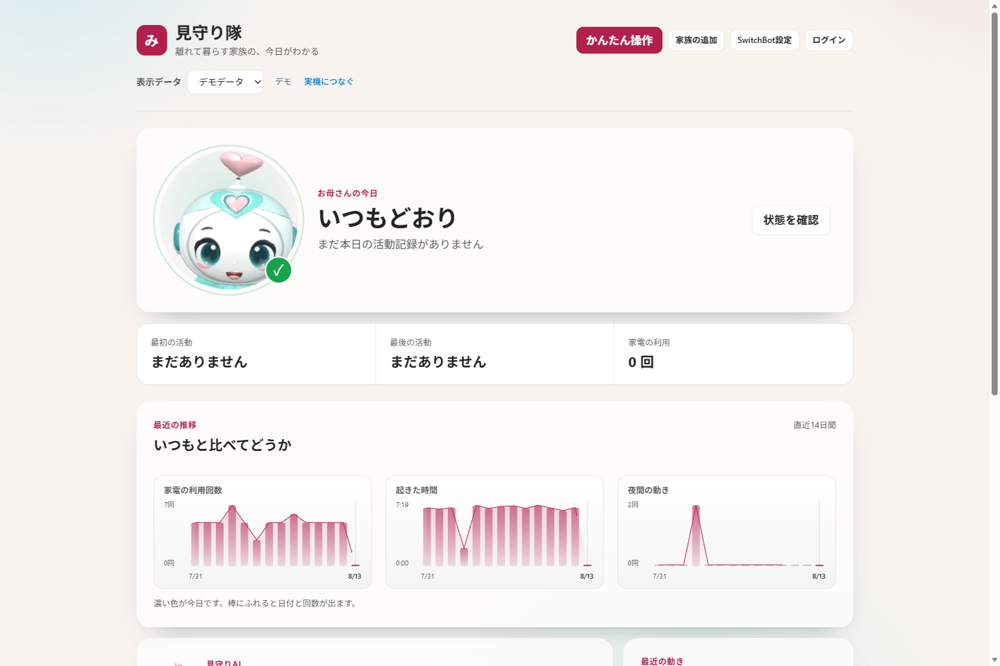

---

## 1. 作ったもの

一人暮らしの親を持つと、「今日は元気にしているだろうか」を毎日確認するのが地味に負担になります。かといってカメラを付けるのは、見られる側にとって受け入れ難い。

そこで **家電の ON/OFF と消費電力だけ**を見ることにしました。

- 朝、照明が点けば「起きた」
- 夜中に何度も点けば「眠れていないかもしれない」
- 昼過ぎまで何も動かなければ「いつもと違う」

映像も音声も取らないので、見られる側の心理的な負担がほぼありません。取れる情報は少ないですが、「生活リズムの変化」を見るには十分でした。

家族側は LINE で聞くだけです。

```
娘：今日のお母さんどう？
Bot：今朝6時40分に寝室の照明が点いています。
　　 いつもより30分早い起床です。日中の活動も普段どおりです。
```

家電の操作もチャットからできます。ただし **ここが本題**で、AI に操作を任せていません。

実際の LINE 画面がこれです。

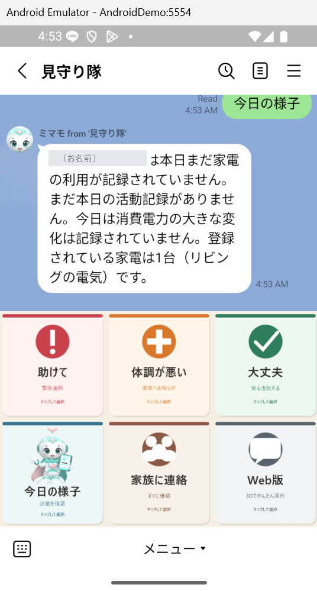

「今日の様子」を押すと、その日の家電の使われ方をまとめて返します。
このスクリーンショットでは、まだその日の記録がないので
**「記録されていません」と正直に返しています**。ここが後述の本題です。

ボタンを押すだけでも使えるようにしてあります。

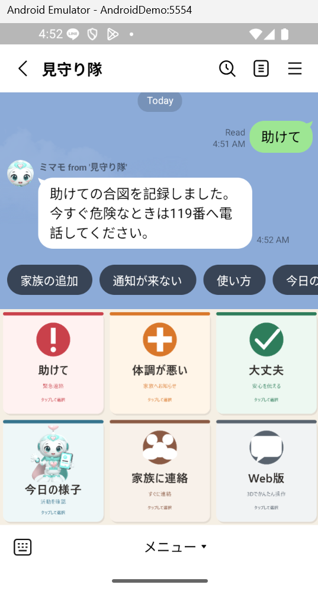

「助けて」には必ず **119番の案内**が付きます。
このサービスは緊急通報の代わりにはならない、という立場を最初に示しています。

---

## 2. いちばん時間をかけたところ：AIを信用しない

LLM に「意図を解析して家電を操作する」をやらせると、デモは一発で動きます。問題は、**間違えたときに何が起きるか**です。

「ストーブつけて」を誤解して真夏に暖房を入れる。深夜に照明を全部点ける。高齢者の家でそれをやると、便利どころか事故です。

なので、AI の出力を**そのまま実行しない**構造にしました。

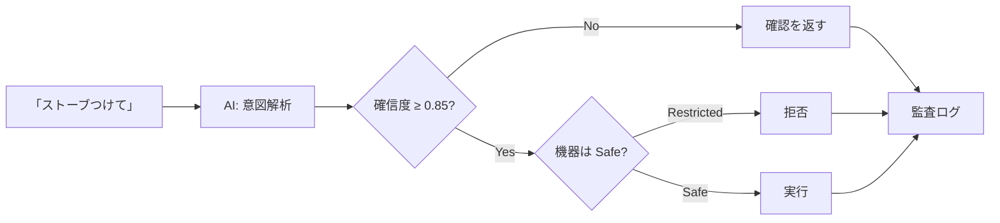

設計の要点は3つです。

**(1) 機器を安全クラスで分ける。**
照明・扇風機は `Safe`、ヒーター類は `Restricted`。AI がどれだけ自信満々に「ONにしろ」と言っても、ルールベースの最終段（`DeviceSafetyPolicy`）がブロックします。

実際に本番環境で「ストーブつけて」と入力した結果がこれです。拒否メッセージが返り、右下の電気ストーブは**停止中のまま**です。

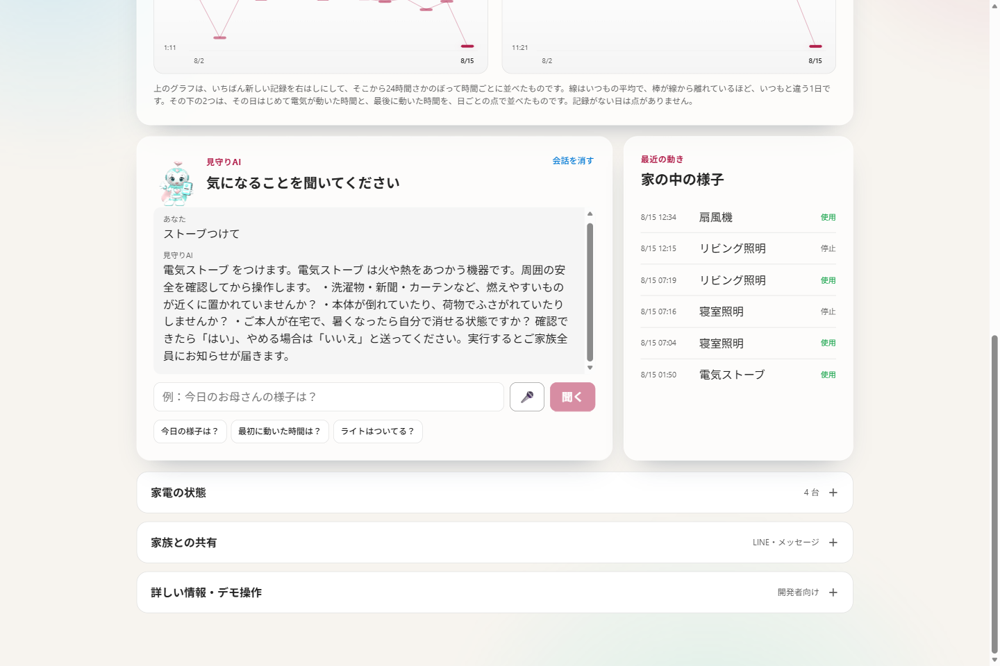

**(2) ON と OFF を非対称にする。**
危険機器の ON は拒否しますが、**OFF は通します**。「消す」は安全性を高める方向の操作だからです。ここを対称にすると「危ないから何も操作できない」になって使い物になりません。

同じストーブに「消して」と言うと、今度は受理されます（実行前に確認を挟みます）。

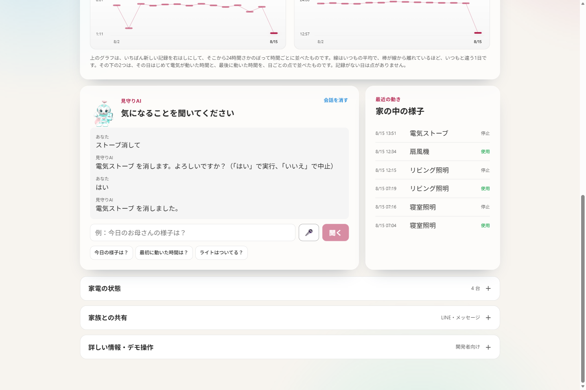

機器カードにも「安全のため、遠隔では消す操作だけできます」と出しています。**拒否の理由が使う人に見えないと、ただの故障に見える**ためです。

**(3) 拒否も含めて全部記録する。**
成功・失敗・拒否のすべてを `DeviceCommand` に残します。「AIが何をしようとしたか」が後から追えないと、そもそも安全性を主張できません。

この「AIは会話には使うが、危険判断には使わない」という線引きが、このプロジェクトで一番考えたところです。

LINE 上でも同じです。自由文の「リビングの電気を付けれる？」に対して、
**必ず「よろしいですか？」を1回挟みます**。

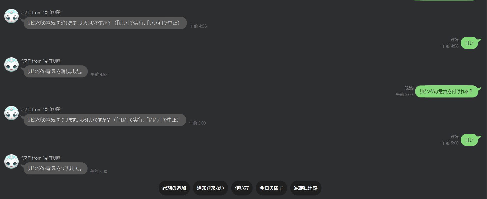

「はい」を受け取ってはじめて実行し、実行後に結果を返します。
この確認は AI の確信度が高くても省略されません。
**AI が担うのは「どの家電をどうしたいか」の解釈までで、実行してよいかを決めるのは人が押した「はい」だけ**です。

**(4) 権限がないときは、枠ごと出さない。**
同じ考え方を管理画面にも通しました。全世帯の状況を見る `/admin` は、サインインが構成されている環境では、許可リストに識別子が載っている利用者だけが中身を見られます。リストが空なら誰も一致しません。未許可のときは、画面の枠だけ出してデータを空にするのではなく、**そもそも読み込み処理を走らせずに `null` を返して拒否**します。同じ画面を出すAPIも、存在自体を答えないよう 404 を返します。

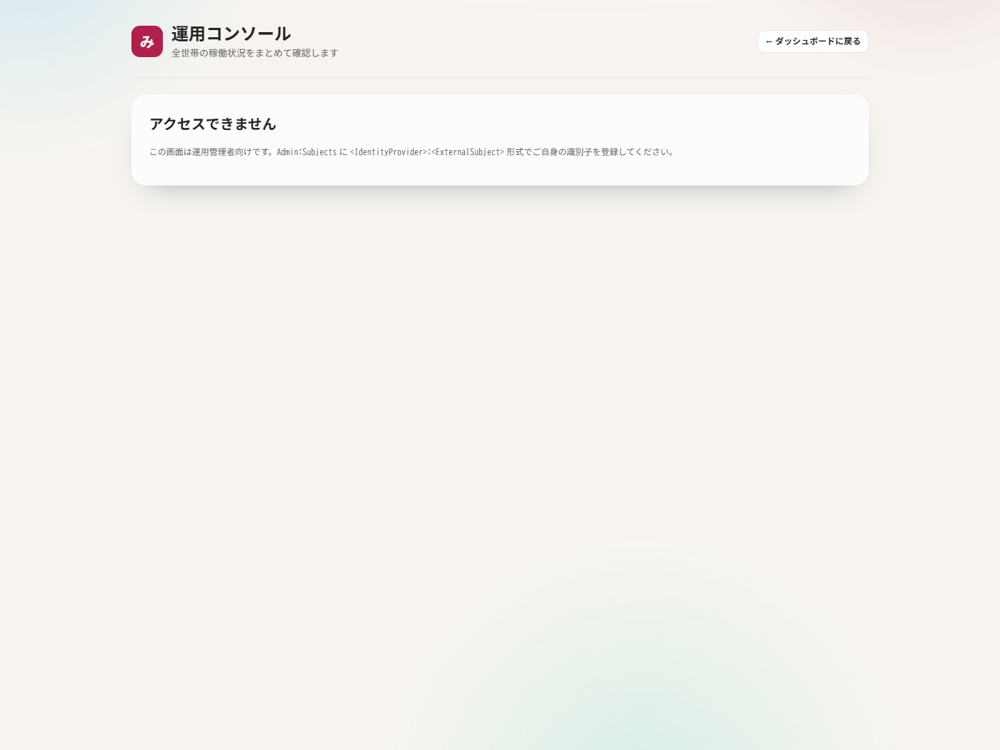

---

## 3. 構成

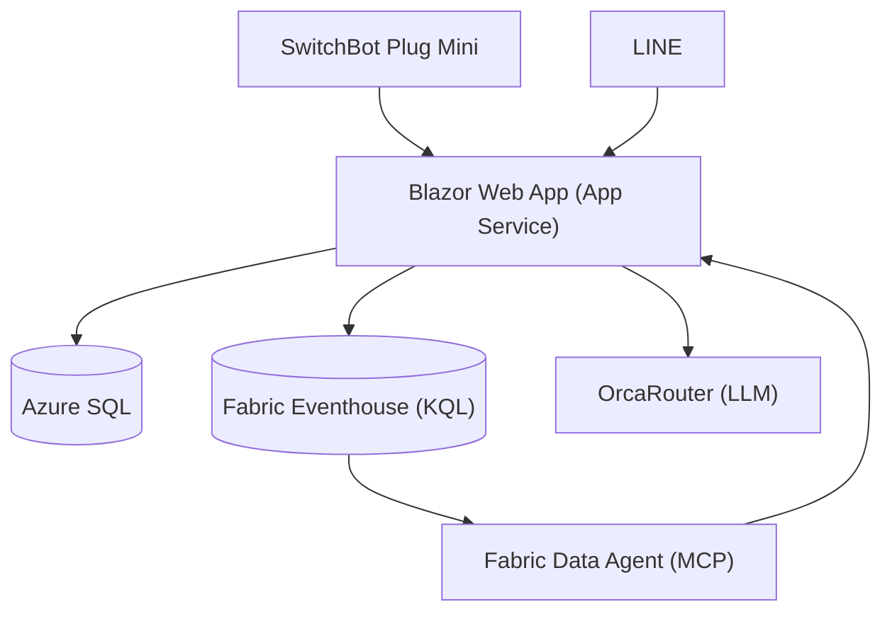

| 用途 | 使ったもの |
|---|---|
| アプリ | .NET 10 / Blazor Web App（InteractiveServer） |
| 業務データ | Azure SQL Database |
| 時系列分析 | Microsoft Fabric Eventhouse（KQL） |
| 自然言語分析 | Fabric Data Agent（MCP 経由） |
| LLM | OrcaRouter |
| デバイス | SwitchBot Plug Mini (JP) |
| 家族接点 | LINE Messaging API / LINE Login / LIFF |

**外部連携はすべてモックに差し替え可能**にしてあります。`dotnet run` だけで、APIキーゼロでフル機能のデモが動きます。ハッカソンで「当日 API が落ちて何も見せられない」を避けたかったのと、テストが書きやすくなるためです。結果的に後者の恩恵のほうが大きく、**テストは681件**まで増えました。

データの流れは2系統に分けています。

- `DeviceEvents` … ON/OFF などの**状態変化**イベント
- `SwitchBotPlugReadings` … ポーリング周期ごとの**電力テレメトリ**（変化がなくても毎回）

意図的にコードを共有していません。片方の設定ミスや障害が、もう片方を巻き込まないようにするためです。**これは後で本当に効きました**（後述）。

蓄積したデータは「いつもと比べてどうか」に変換して見せています。絶対値ではなく**平常時との差**にしたのは、そもそも「普通」が人によって違うからです。

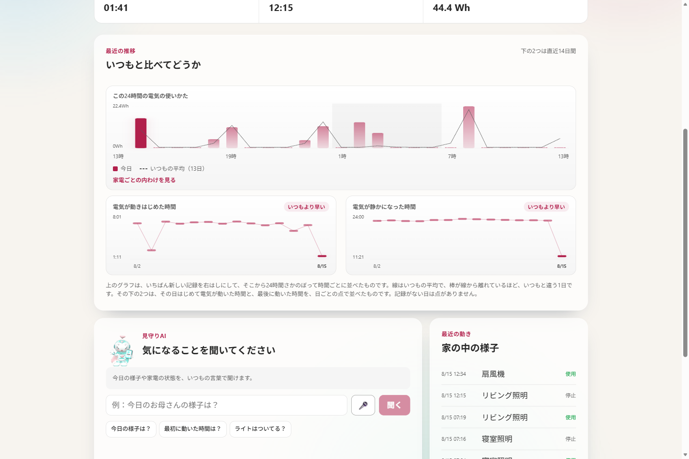

---

## 4. 沈黙して壊れた3つの話

ここからが本題です。3つとも共通点があります。**エラーが出ませんでした。**

### 4-1. 存在しないテーブルに1日半投げ続けて、容量を焼いた

Plug Mini のテレメトリ用に `SwitchBotPlugReadings` テーブルを追加しました。アプリ側の実装を書き、デプロイし、動いているつもりでいました。

**Eventhouse 側にテーブルを作っていませんでした。**

取り込み API は HTTP 400 を返します。アプリはリトライします。1分ごとに、1日半。F2 容量（一番小さいやつ）はそれで飽和し、**関係ないはずの運用コンソールまで 429 で落ちました**。

痛かったのは、これが「アプリのエラー」として見えなかったことです。publisher は例外を投げずに次回リトライする設計にしてありました。障害に強くするための設計が、**失敗を見えなくしていた**わけです。

対処として、失敗理由を必ず記録するようにしました。「失敗した」ではなく「**なぜ**失敗したか」です。これがないと、ユーザーに「なんで動いてないの？」と聞かれたときに答えられません。

そして「2系統を分けておいてよかった」のがここでした。`DeviceEvents` 側は無事だったので、全滅は避けられています。

### 4-2. Eventstream の宛先が Paused のまま、送信は成功していた

提出前の確認で、`DeviceEvents` が **8/09 で止まっている**のを見つけました。`SwitchBotPlugReadings` は直近まで入っているのに、です。

アプリから手動で送ってみると、**成功します**。

```
{"publisher":"EventHub","published":5,"error":null}
```

Event Hub は受け取っています。でも Eventhouse に着きません。Fabric の Eventstream のトポロジを REST で見て、原因がわかりました。

```json
{ "name": "ToEventhouse", "type": "Eventhouse", "status": "Paused" }
```

**宛先が一時停止していました。** おそらく 4-1 で容量が飽和したときに巻き込まれています。

厄介なのは、送信側から見ると完全に成功に見えることです。Event Hub は受理し、アプリは「送信済み」フラグを立て、以後**二度と再送しません**。3日分のデータが、誰にもエラーを出さずに消えていました。

構成上、`DeviceEvents` だけが `アプリ → Event Hub → Eventstream → Eventhouse` という**ホップの多い経路**を通っていたのが効いています。`SwitchBotPlugReadings` は Eventhouse に直接 REST で入れていたので無傷でした。

デモ環境なので、`DeviceEvents` も**直接取り込みに寄せました**。中継を1つ減らして、壊れうる箇所を減らす判断です。欠落分は再送で回収し、重複は KQL で除去しました。

> 教訓として持ち帰ったのは、**「送信成功」は「到達」ではない**、という当たり前のことでした。到達側を見ないと気づけません。

なお提出直前に Eventstream の宛先を改めて有効化し、両方の宛先が動いている状態に戻しました。

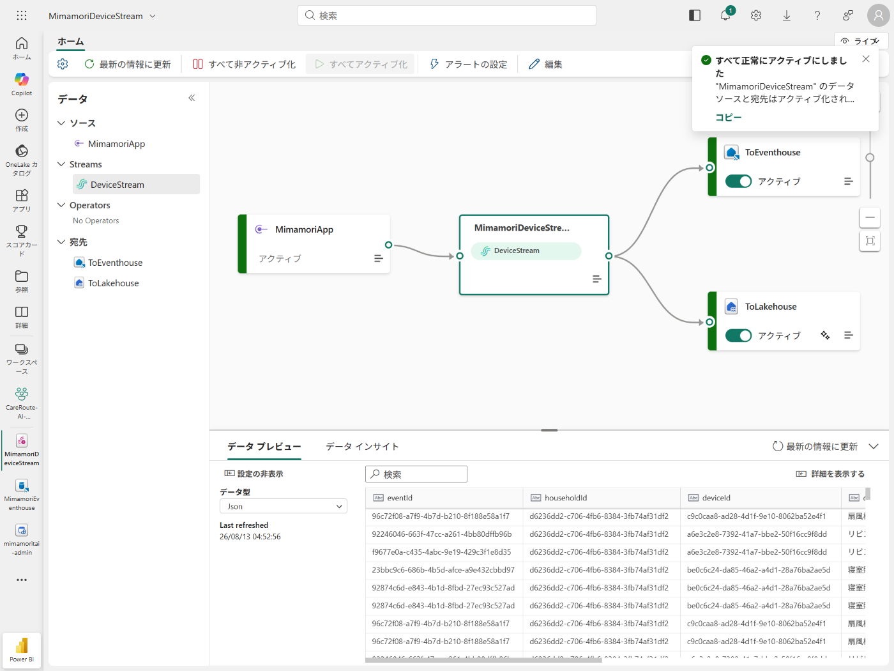

裏を返すと、**この経路が止まっている間も見守り自体は動いていました**。
主経路を Azure SQL に置き、Fabric は分析用の副経路にしていたためです。
壊れた側が主経路でなかったのは、たまたまではなく、そう置いていたからでした。

### 4-3. 3Dマスコットが一度も起動していなかった（そして私はそれを「動いている」と報告した）

トップに 3D のマスコットキャラクターを置いています。ある日「**まったくアニメーションが動いていない**」と指摘を受けました。

私は直前に動作確認をして「動いています」と報告していました。**間違っていたのは私のほうでした。**

調べると、

- three.js は読み込み済み
- **3Dモデル（.glb）へのリクエストが1回も飛んでいない**
- コンソールエラーは**ゼロ**

原因は初期化のタイミングでした。マスコットは「データ読み込み中」の分岐の**外側**にあります。

```razor
@if (_model is null) { <p>読み込み中…</p> }
else { <div data-mascot-model="..."><canvas></canvas></div> }
```

初期化は「最初の描画のあと」に一度だけ走ります。しかしその瞬間、`_model` はまだ null なので、**マスコットの入れ物は DOM に存在しません**。要素を探す処理は 0 件にヒットし、何も起きず、例外も出ず、そして二度と呼ばれません。表示されていたのは静止画のポスター画像でした。

**なぜ私は「動いている」と誤判定したか**が、この話の本題です。

私はスクリーンショットを複数枚撮って、差分があることを根拠にしました。ところがその差分は、マスコットの周囲にある**CSSアニメーション**（ステータスリングの明滅）でした。3Dが完全に止まっていても差分は出ます。**測っている対象が違った**わけです。

ピクセルを直接読む方法も試していて、そちらは全ゼロでした。本来はそこで「測定できていない」と疑うべきでしたが、「差分が出た方」を信じてしまいました。都合のいい計測結果を採用した、という典型的な失敗です。

修正は、呼ぶ側にタイミングを当てさせるのをやめて、**入れ物が現れたら気づく**方式にしました（MutationObserver）。同じ構造だった他の2ページも、同時に直っています。

検証もやり直しました。

- `.glb` が **200** で取得されている
- 起動完了まで **2.1秒**
- canvas 領域**だけ**を切り出した8枚がすべて別画像
- ポスター画像が透明化している（＝3Dが前面にいる）
- 目視でも首の傾きとハートの位置が動いている

「動いている」と言う前に、**その計測方法が本当に有効かを疑う**。今回いちばん高くついた教訓でした。

---

## 5. やってみて思ったこと

**沈黙する失敗がいちばん高くつきます。** 3件とも、例外は投げていません。むしろ「例外を投げずにリトライする」「エラーが出ないよう握る」という**丁寧に書いたつもりの部分**が、失敗を見えなくしていました。リトライを入れるなら、同時に「何回失敗したか・なぜか」を見る場所を作らないと、静かに燃え続けます。

**中継は少ないほうが強いです。** Eventstream は機能としては便利ですが、ホップが増えるぶん「送信は成功しているのに届かない」状態が作れてしまいます。デモ規模なら直接書くほうが壊れにくいです。

**モック可能にしたのは正解でした。** APIキーゼロで全機能が動く構成にしたおかげで、テストが681件まで書けました。今回の障害のうち2件は、結局テストではなく本番の実測で見つかっていますが、逆に言えば**「テストが通っている＝動いている」ではない**ことの実例でもあります。

---

## 6. リンク

- リポジトリ: https://github.com/monoqlo78/mimamoritai-careroute-ai
- デモ: https://app-mimamoritai-hack.azurewebsites.net/
- 稼働証跡（開発機以外からの到達性・TLS・画面）: [docs/EVIDENCE.md](https://github.com/monoqlo78/mimamoritai-careroute-ai/blob/main/docs/EVIDENCE.md)

なお、高齢の利用者本人が使う画面は文字とボタンを大きくした別画面（`/one-touch`）にしてあります。見守る側と見守られる側で、必要な情報がまったく違うためです。

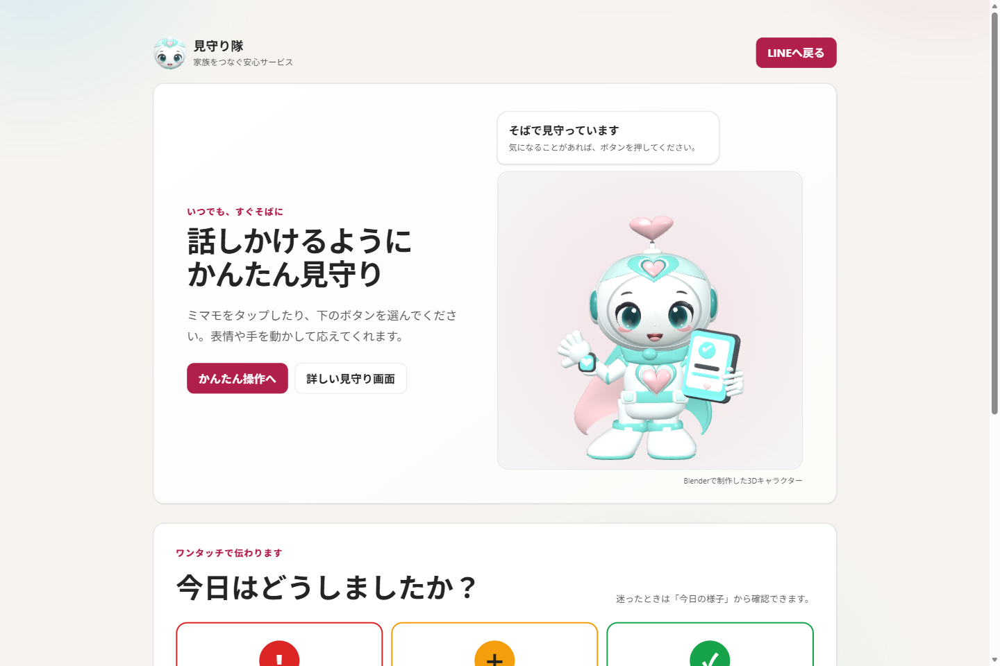

---

### 補足：安全設計の実際のコード感

安全判定はここに集約されています。AI の出力は「候補」でしかなく、最終判断は必ずこのルールを通ります。

```csharp
// 機器の種類から安全クラスを決める。既知の安全な物「以外」はすべて Restricted。
// 許可リスト方式にしてあるので、新しい機器が増えても既定で危険側に倒れる。
public static SafetyClass Classify(DeviceType type) => type switch
{
    DeviceType.Light or DeviceType.Fan or DeviceType.DemoDevice => SafetyClass.Safe,
    _ => SafetyClass.Restricted
};

// 危険機器は ON と Toggle を拒否する。TurnOff がこの条件に入っていないのが要点で、
// 「消す」だけは通る。
if (device.SafetyClass == SafetyClass.Restricted
    && action is DeviceAction.TurnOn or DeviceAction.Toggle)
{
    return $"{device.DisplayName} は安全のため音声・チャットからの操作を禁止しています。";
}
```

地味に効いているのが `Classify` の `_ => Restricted` です。**知らない機器は危険とみなす**ので、SwitchBot から新しい機器が同期されてきても、勝手に操作対象になりません。同期処理も `RemoteControlAllowed` を自分で立てないようにしてあり、遠隔操作の許可は人間が明示的に与える必要があります。

行数にすると大したことはありません。ただ、**この十数行を LLM の外側に置いたか、内側で「そうしてね」とお願いしたか**が、このプロジェクトで一番の分岐点だったと思っています。
