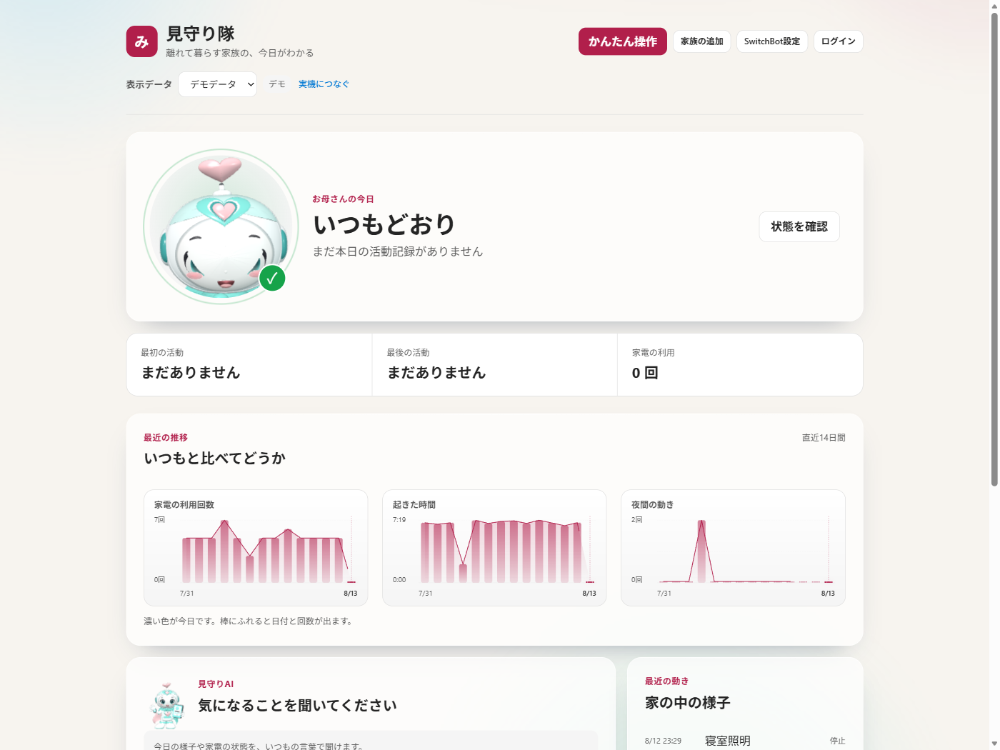
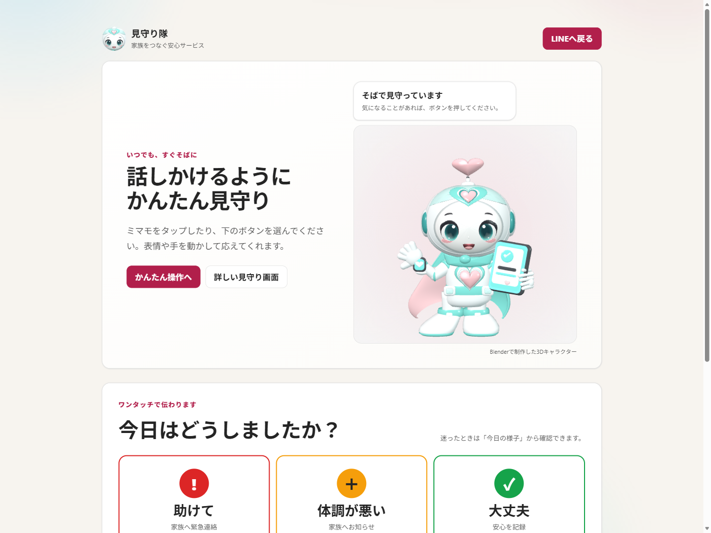

# 稼働証跡 / Evidence

提出物が「動いている」ことを、開発機以外から確認した記録です。

- 本番URL: <https://app-mimamoritai-hack.azurewebsites.net/>
- 取得日時: 2026-08-12 19:02 UTC（2026-08-13 04:02 JST）

---

## 1. 独立した環境からの到達性

開発に使ったPCとは別の Azure 仮想マシンから、公開URLへ実際にアクセスして確認しました。
開発機のキャッシュやローカル設定に依存していないことを示すためです。

| 項目 | 値 |
| --- | --- |
| 検証元ホスト | `blendercodex`（Azure VM / Windows 11 Pro） |
| 検証元の外向きIP | `20.78.x.x`（開発PCとは別ネットワーク） |
| 名前解決 | `app-mimamoritai-hack.azurewebsites.net` → `20.189.196.1` |

### HTTP応答

| パス | ステータス | 応答時間 | サイズ |
| --- | --- | --- | --- |
| `/` | 200 | 391 ms | 47,766 B |
| `/health` | 200 | 59 ms | 61 B |
| `/one-touch` | 200 | 88 ms | 13,071 B |
| `/admin` | 200 | 155 ms | 8,723 B |
| `/liff` | 200 | 88 ms | 8,770 B |
| `/not-found` | 200 | 85 ms | 7,175 B |

### TLS

| 項目 | 値 |
| --- | --- |
| Subject | `CN=*.azurewebsites.net, O=Microsoft Corporation, L=Redmond, S=WA, C=US` |
| Issuer | `CN=Microsoft TLS G2 RSA CA OCSP 02, O=Microsoft Corporation, C=US` |
| 有効期限 | 2027-01-10 |

### 配信されているHTMLの内容確認

トップページのHTML（46,735バイト）に、以下の文字列が含まれることを確認しました。
静的なプレースホルダではなく、実際のアプリが配信されていることの確認です。

| マーカー | 含まれるか |
| --- | --- |
| `CareRoute` | あり |
| `SwitchBot` | あり |
| `blazor` | あり |
| `_framework`（Blazor のランタイム） | あり |
| 日本語（かな・漢字） | あり |

---

## 2. 画面の証跡

### 2-1. トップ画面

家族が最初に見る画面です。「いつもどおり」という一言を最上段に置き、
数字は下に回しています。直近14日の推移は、家電の利用回数・起きた時間・夜間の動きの3本。

なお撮影時刻が午前4時のため、「本日の活動」はまだ0回です。
14日間の推移グラフには過去分が描かれており、当日分だけが空という
実際の運用でも起きる状態がそのまま出ています。

### 2-2. ワンタッチ画面

見守られる側（高齢の家族）が使う画面です。ボタンは3つだけ。
右のキャラクターは Blender で制作し、Three.js でブラウザ上に表示しています。

### 2-3. 運用コンソール（未認証時）

`/admin` に未認証でアクセスした場合の画面です。
**画面の枠だけ出して中身を空にするのではなく、データを一切読み込まずに拒否**します。
サインインが構成された環境では、許可リスト（`Admin:Subjects`、
`<IdentityProvider>:<ExternalSubject>` 形式）に載っている識別子だけが一致します。
リストが空なら誰も一致しません。同じデータを返すAPI側も、未許可なら 404 を返して
エンドポイントの存在自体を答えない作りです。

---

## 3. 検証方法

### VMからの到達性確認

Azure VM 上で PowerShell を実行し、以下を取得しました。

- `Invoke-WebRequest` による各パスのステータス・応答時間・サイズ
- `HttpWebRequest.ServicePoint.Certificate` によるTLS証明書
- `Resolve-DnsName` による名前解決結果
- 外向きIPの確認

### 画面キャプチャ

公開URLに対して Playwright（Chromium / 1400×1050）でアクセスし取得しました。
認証を伴わない状態での表示です。

---

## 4. 補足

- `/admin` `/liff` は認証前提の画面のため、上記のステータス200は
  「拒否画面が正しく返っている」ことを意味します。
- `/health` はヘルスチェック用のエンドポイントで、61バイトの応答を返します。
